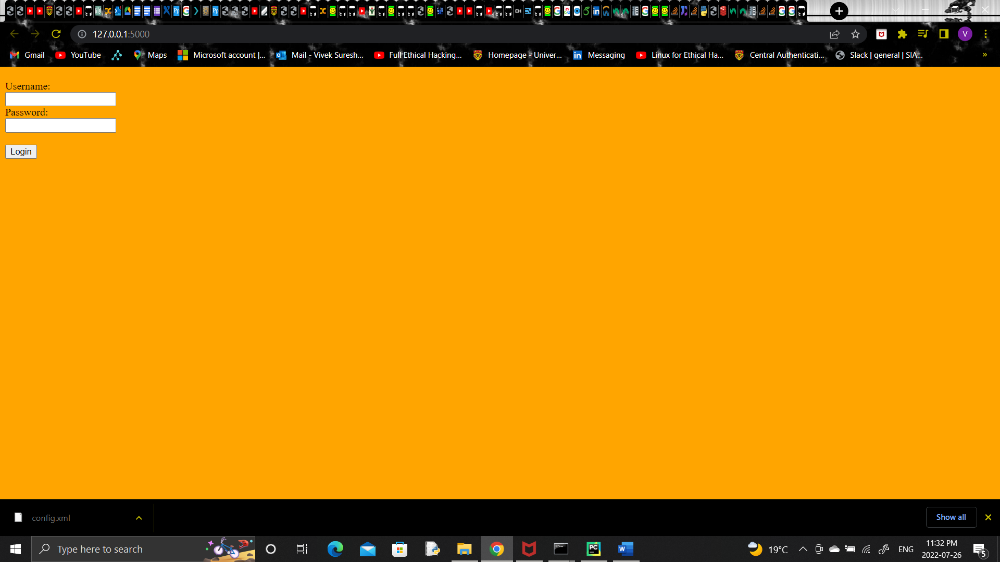
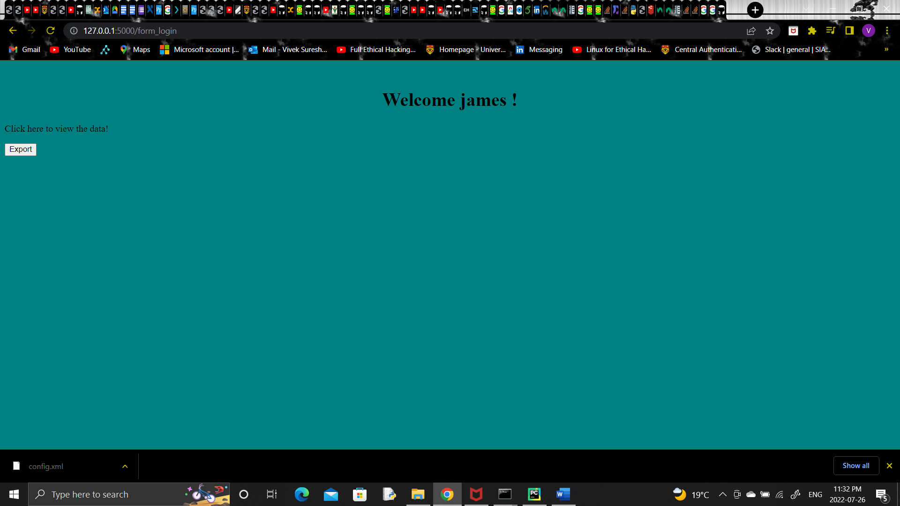
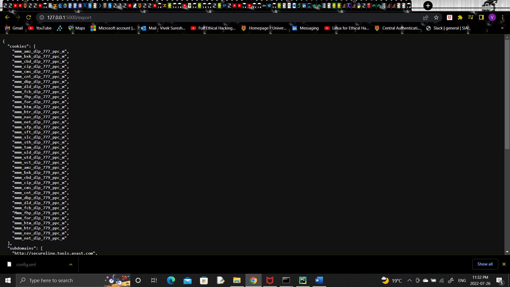

<h1 align="center">Emaww project - APP </h1>

# Project Description
Simple app to export xml file as keys - subdomains and cookies. Involves performing parsing of the xml data and simple computation to export subdomains and cookies. App is also built with initial login-template that requires username and password for authentication. Default username and passwords are created as dictionary in the sample.py, however, further it could be extended as database model in-future to create, store, validate and retreive user-credentials at server-side.  

Exported data.

# Built with

The following are the tech stack with which the project was completed.
<ul>- flask</ul>
<ul>- element tree</ul>
<ul>- redis</ul>
<ul>- HTML</ul>
<ul>- Docker</ul>

# How to run the app
The app could run at cli with flask as well as with docker.

### Method-1: With flask app server. 

***set FLASK_APP=sample.py*** 
  
***flask run*** 
: (Running on http://127.0.0.1:5000/ (Press CTRL+C to quit)) 

   

### Method-2: As a docker container.

   

Step-1: To build docker images.   

***docker image build -t sample .***
   

Step-2: To see docker images.
   
***docker image ls***
   

Step-3: To run docker and to check docker containerID.   
***docker run -p 5000:5000 -d sample***
   
Step-4: To run    
***docker-compose up*** : The following server should fireup - Running on http://172.20.0.2:5000/ (Press CTRL+C to quit).

